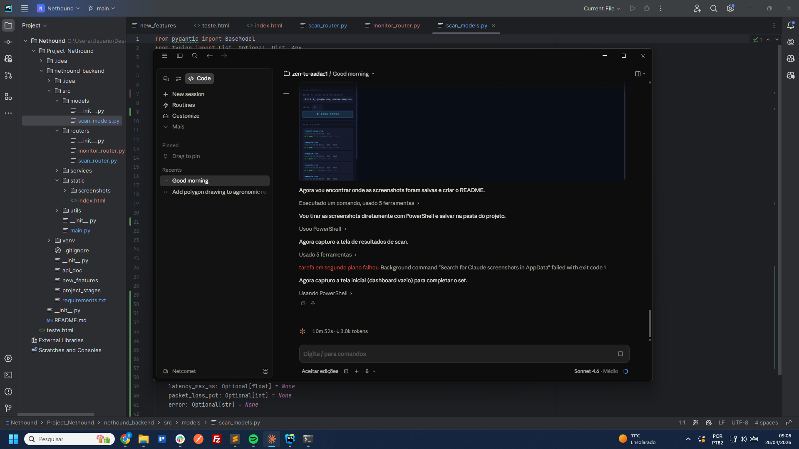
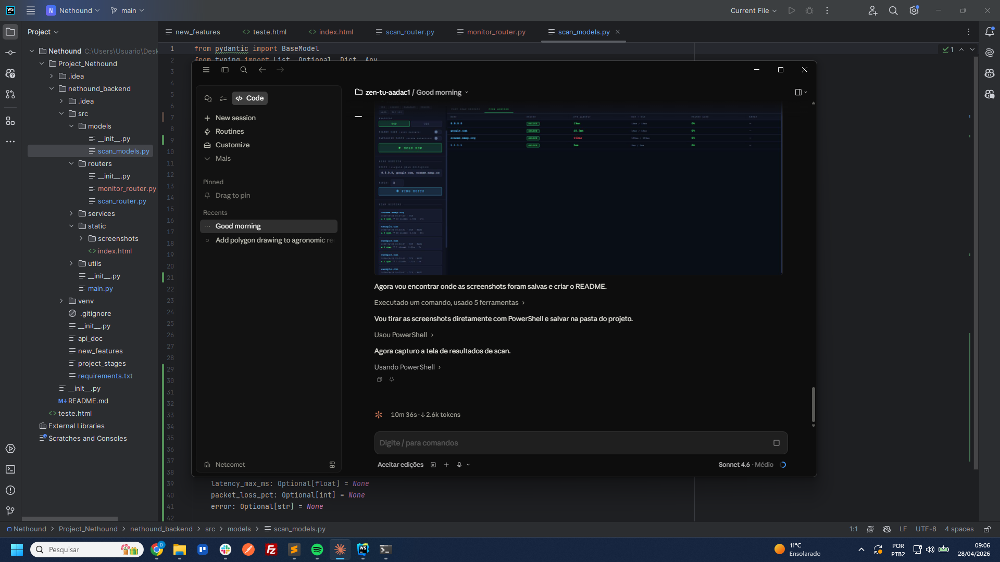
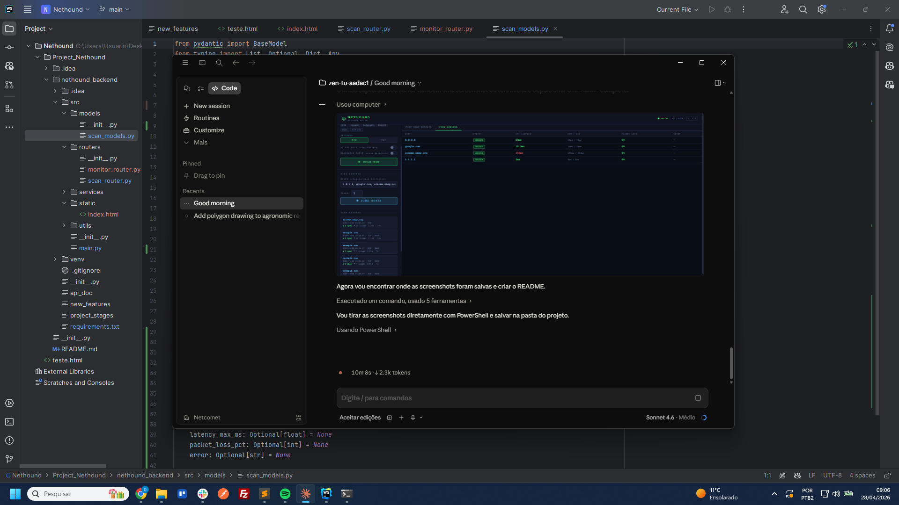

# NETHOUND

> Ferramenta de reconhecimento de rede — escaneamento de portas, captura de banners, inspeção SSL/TLS e monitoramento de disponibilidade de hosts.



## Funcionalidades

- **Scanner TCP/UDP** — escaneia portas individuais, intervalos ou listas separadas por vírgula em qualquer IP ou hostname
- **Banner Grabbing** — detecção automática de serviços HTTP, SSH, FTP e SMTP
- **Inspeção SSL/TLS** — extrai CN, emissor, datas de validade e status de expiração do certificado
- **Scan Concorrente** — até 50 workers paralelos; scans de 100 portas que levavam ~100s passam a levar ~2s
- **Ordem Randomizada** — embaralha a sequência de varredura para evitar assinaturas de detecção sequencial
- **Monitor de Ping** — verifica a disponibilidade de múltiplos hosts simultaneamente com latência e packet loss
- **Presets de Portas** — atalhos para Web, Comuns, Banco de Dados, Acesso Remoto, E-mail e Top 100
- **Histórico de Scans** — mantém os últimos 20 scans com replay por clique
- **Exportação** — baixe os resultados em JSON ou CSV

## Screenshots

### Resultados do Scan de Portas


### Monitor de Ping


## Tecnologias

| Camada    | Tecnologia |
|-----------|-----------|
| Backend   | Python 3.11 · FastAPI · Uvicorn |
| Frontend  | HTML · CSS · JavaScript puro (sem build tools) |
| Varredura | `socket` · `ssl` · `OpenSSL` · `ThreadPoolExecutor` |

## Como Executar

```bash
# 1. Criar e ativar o ambiente virtual
cd nethound_backend
python -m venv venv
.\venv\Scripts\activate   # Windows
source venv/bin/activate  # Linux/Mac

# 2. Instalar dependências
pip install -r requirements.txt

# 3. Iniciar
cd src
uvicorn main:app --host 0.0.0.0 --port 8585 --reload
```

Acesse `http://localhost:8585` no navegador.

A documentação interativa da API está disponível em `http://localhost:8585/docs`.

## Endpoints da API

| Método | Rota | Descrição |
|--------|------|-----------|
| `POST` | `/scan/` | Executar um scan de portas |
| `GET` | `/scan/presets` | Listar presets de portas |
| `GET` | `/scan/history` | Últimos 20 scans |
| `DELETE` | `/scan/history` | Limpar histórico |
| `POST` | `/monitor/ping` | Pingar múltiplos hosts |
| `GET` | `/health` | Status da API |

### Exemplo de requisição de scan

```json
{
  "ip": "scanme.nmap.org",
  "ports": "22,80,443",
  "protocol": "TCP",
  "silent_mode": false,
  "randomize": false
}
```

## Roadmap

- [ ] Sniffer passivo (scapy)
- [ ] Analisador de protocolos (HTTP, DNS, TLS camada 7)
- [ ] Monitoramento agendado com alertas
- [ ] Módulo de firewall CerberusGate

## Licença

MIT
